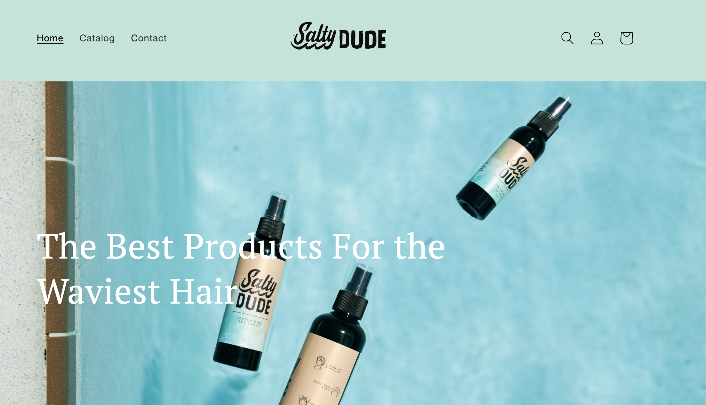
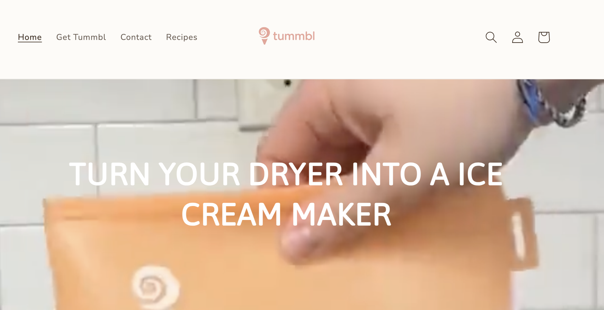
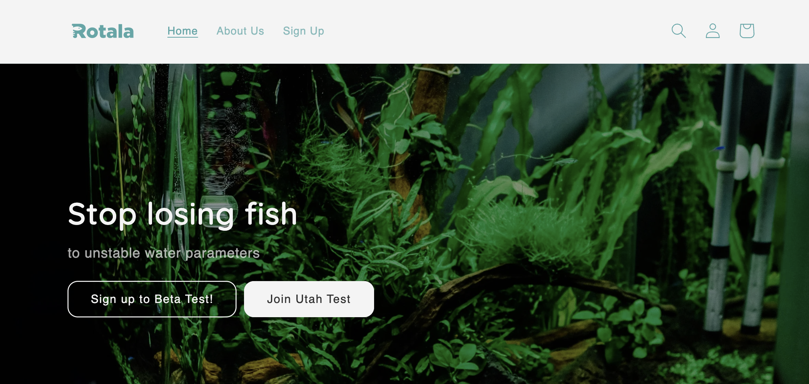
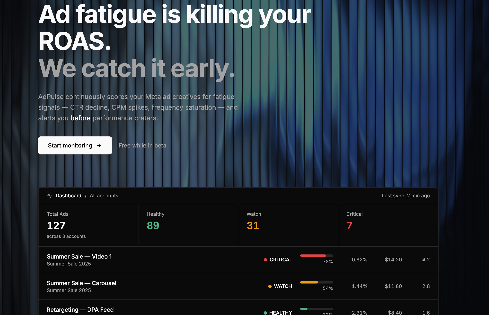

::: {.hero-banner}

# Ben Hall

<h2>Entrepreneur · Shopify Specialist · Meta Advertising · AI Product Builder</h2>

Crocker Innovation Fellow · BYU Marriott School of Business '26

<a href="https://www.linkedin.com/in/ben-hall-55a3a0253/" class="btn btn-outline-primary" target="_blank">
  <i class="fab fa-linkedin"></i> LinkedIn
</a>
<a href="https://github.com/benhall1" class="btn btn-outline-primary" target="_blank">
  <i class="fab fa-github"></i> GitHub
</a>
<a href="about.qmd#resume" class="btn btn-outline-primary">
  <i class="fa-solid fa-file-lines"></i> Resume
</a>

:::

My Work

## Websites I've Built

<a href="https://saltydudeco.com" class="site-card" target="_blank" rel="noopener">

<h3>Salty Dude</h3>

E-commerce brand and online store.

  <i class="fa-solid fa-arrow-up-right-from-square"></i> Visit Site

</a>
<a href="https://tummbl.com" class="site-card" target="_blank" rel="noopener">

<h3>Tummbl</h3>

Web platform and digital product.

  <i class="fa-solid fa-arrow-up-right-from-square"></i> Visit Site

</a>
<a href="https://rotalasystems.com" class="site-card" target="_blank" rel="noopener">

<h3>Rotala</h3>

Technology solutions and systems.

  <i class="fa-solid fa-arrow-up-right-from-square"></i> Visit Site

</a>

---

Featured Project

## AdPulse — Ad Fatigue Monitor

A SaaS web app that tracks Meta ad creative fatigue and alerts marketers when ads are underperforming. Monitors ROAS decline, CTR drops, CPC increases, and frequency saturation to prevent wasted ad spend. Built with Next.js, Supabase, and Claude Code.

<a href="https://adpulse-flame.vercel.app/" class="btn btn-primary btn-sm" target="_blank">
  <i class="fa-solid fa-arrow-up-right-from-square"></i> Try Live Demo
</a>
<a href="projects/project-2.qmd" class="btn btn-outline-dark btn-sm">
  View Details →
</a>

---

What I'm Working On

## Problem-First Product Thinking

I believe great products start with understanding problems worth solving. I'm currently exploring challenges around:

- **Ad creative fatigue** — How can marketers catch declining ad performance before wasting spend?
- **Idea validation** — How can entrepreneurs test ideas before building?
- **Priority management** — How do we focus without burning out?

<a href="problems.qmd" style="display: inline-flex; align-items: center; gap: 0.5rem; font-weight: 600;">
  See all 5 problems I'm exploring <i class="fa-solid fa-arrow-right"></i>
</a>

---

About Me

## Entrepreneurial Management @ BYU

I'm a senior studying Entrepreneurial Management at Brigham Young University. I'm passionate about building products that solve real problems and exploring the intersection of technology and business.

<a href="about.qmd" class="btn btn-primary">
  Learn More About Me
</a>
<a href="about.qmd#resume" class="btn btn-outline-dark">
  <i class="fa-solid fa-download" style="margin-right: 0.5rem;"></i> Download Resume
</a>

